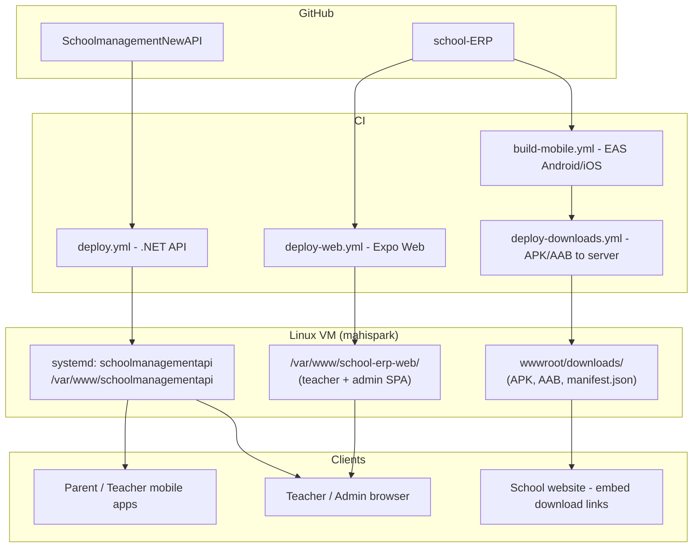

# School ERP — Deployment & CI/CD Plan

This document describes how **API server**, **teacher/admin web**, **Android/iOS apps**, and **school-website download SDK** fit together and how pipelines deploy each piece.

## Architecture overview



| Deliverable | Repo | Pipeline | Deploy target | URL (example) |
|-------------|------|----------|---------------|----------------|
| **.NET API** | `SchoolmanagementNewAPI` | `.github/workflows/deploy.yml` | `/var/www/schoolmanagementapi/` | `https://schoolmanagement.mahispark.com` |
| **Teacher/Admin Web** | `school-ERP` | `.github/workflows/deploy-web.yml` | `/var/www/school-erp-web/` | `https://app.schoolmanagement.mahispark.com` |
| **Android APK/AAB** | `school-ERP` | `build-mobile.yml` → `deploy-downloads.yml` | API `wwwroot/downloads/` | `https://schoolmanagement.mahispark.com/downloads/...` |
| **iOS** | `school-ERP` | EAS → TestFlight/App Store (optional submit) | App Store or enterprise IPA on server | App Store / direct link |

## Phase roadmap

### Phase 1 — Infrastructure (now)
- [x] API deploy on push to `main` (existing in backend repo)
- [x] Web static deploy pipeline (`deploy-web.yml`)
- [x] Mobile EAS build pipeline (`build-mobile.yml`)
- [x] Copy Android artifacts to server downloads folder (`deploy-downloads.yml`)
- [x] Public download manifest API (`GET /api/Downloads/manifest`)

### Phase 2 — Web go-live (teacher + admin)
- Point subdomain DNS to server (`app.` or `erp.`)
- Nginx serves `school-erp-web` with SPA fallback
- Set `EXPO_PUBLIC_API_URL` in GitHub secrets for production builds
- Restrict marketing site links: schools embed manifest URLs for mobile; staff use web URL

### Phase 3 — Store & school branding (later)
- Per-school white-label builds (EAS `APP_VARIANT` + env)
- iOS App Store / Play Store release tracks
- Optional: school subdomain per tenant (`school-a.app...`)

## GitHub secrets (both repos)

Configure under **Settings → Secrets and variables → Actions**.

### Shared server deploy (web + downloads)

| Secret | Description |
|--------|-------------|
| `SERVER_SSH_KEY` | Base64-encoded private SSH key (same as API deploy) |
| `SERVER_IP` | VM IP or hostname |
| `SERVER_USERNAME` | SSH user (e.g. `deploy`) |

### school-ERP only

| Secret | Description |
|--------|-------------|
| `EXPO_TOKEN` | Expo access token ([expo.dev/settings/access-tokens](https://expo.dev/settings/access-tokens)) |
| `EXPO_PUBLIC_API_URL` | Production API base, e.g. `https://schoolmanagement.mahispark.com` |
| `SERVER_WEB_PATH` | Optional; default `/var/www/school-erp-web` |
| `SERVER_DOWNLOADS_PATH` | Optional; default `/var/www/schoolmanagementapi/wwwroot/downloads` |

### EAS / signing (when ready for store builds)

| Secret | Description |
|--------|-------------|
| `EXPO_APPLE_ID` | Apple ID for EAS iOS credentials |
| `EXPO_APPLE_APP_SPECIFIC_PASSWORD` | App-specific password |
| Android keystore | Upload via `eas credentials` (not stored in repo) |

## Server directory layout

```text
/var/www/schoolmanagementapi/          # .NET published API (systemd)
  wwwroot/
    downloads/
      school-erp-latest.apk
      school-erp-latest.aab
      manifest.json                    # generated by deploy-downloads.yml
      ios/                             # optional enterprise IPA

/var/www/school-erp-web/               # Expo web export (nginx root)
  index.html
  _expo/
  assets/
```

## Nginx (example)

```nginx
# API — existing reverse proxy to Kestrel :5000
server {
    server_name schoolmanagement.mahispark.com;
    location / {
        proxy_pass http://127.0.0.1:5000;
        proxy_http_version 1.1;
        proxy_set_header Host $host;
        proxy_set_header X-Forwarded-For $proxy_add_x_forwarded_for;
        proxy_set_header X-Forwarded-Proto $scheme;
    }
}

# Teacher / Admin web SPA
server {
    server_name app.schoolmanagement.mahispark.com;
    root /var/www/school-erp-web;
    index index.html;
    location / {
        try_files $uri $uri/ /index.html;
    }
}
```

## School website integration

Schools add download buttons using the manifest API (no auth required):

```http
GET https://schoolmanagement.mahispark.com/api/Downloads/manifest
```

Example response:

```json
{
  "appName": "School ERP",
  "version": "1.0.0",
  "android": { "apk": "https://schoolmanagement.mahispark.com/downloads/school-erp-latest.apk" },
  "ios": { "appStoreUrl": null, "note": "Install from App Store when published" }
}
```

Embed on school site:

```html
<a id="android-dl" href="#">Download Android App</a>
<script>
  fetch('https://schoolmanagement.mahispark.com/api/Downloads/manifest')
    .then(r => r.json())
    .then(m => { document.getElementById('android-dl').href = m.android?.apk; });
</script>
```

Staff (teacher/admin) use the **web app URL**, not the APK.

## Pipeline triggers

| Workflow | Trigger |
|----------|---------|
| `ci.yml` | PR + push to `main` |
| `deploy-web.yml` | Push to `main` (app/src changes) or manual |
| `build-mobile.yml` | Manual, version tag `v*`, or weekly schedule |
| `deploy-downloads.yml` | After mobile build or manual (artifact input) |
| Backend `deploy.yml` | Push to `main` in `SchoolmanagementNewAPI` |

## Android EAS build troubleshooting

If `Gradle build failed` on **Run gradlew**:

1. Open the build on [expo.dev](https://expo.dev) → failed build → **Run gradlew** log.
2. Common fix for this project: avoid unused `react-native-reanimated` / `react-native-worklets` (native C++); the app uses RN `Animated` only.
3. Retry with cache cleared: `eas build --platform android --profile production-apk --clear-cache`
4. Ensure `package-lock.json` is committed and in sync: `npm ci` locally before push.

## Local commands

```bash
# Web production build
EXPO_PUBLIC_API_URL=https://schoolmanagement.mahispark.com npm run build:web

# EAS login & build (first time)
npx eas-cli login
npx eas-cli build --platform android --profile production
npx eas-cli build --platform ios --profile production
```

## One-time server setup

```bash
sudo mkdir -p /var/www/school-erp-web /var/www/schoolmanagementapi/wwwroot/downloads
sudo chown -R $USER:www-data /var/www/school-erp-web /var/www/schoolmanagementapi/wwwroot/downloads
sudo chmod -R 775 /var/www/schoolmanagementapi/wwwroot/downloads
# Reload nginx after adding app.* server block
sudo nginx -t && sudo systemctl reload nginx
```

## Role matrix (web vs mobile)

| Role | Web (live) | Mobile |
|------|------------|--------|
| superadmin / admin | Yes — full dashboard | Optional |
| teacher | Yes — attendance, marks, homework | Primary |
| parent | Limited web (future) | Primary |

Web and mobile share the same Expo codebase; login role from JWT drives UI (see `src/store/authStore.ts`).
